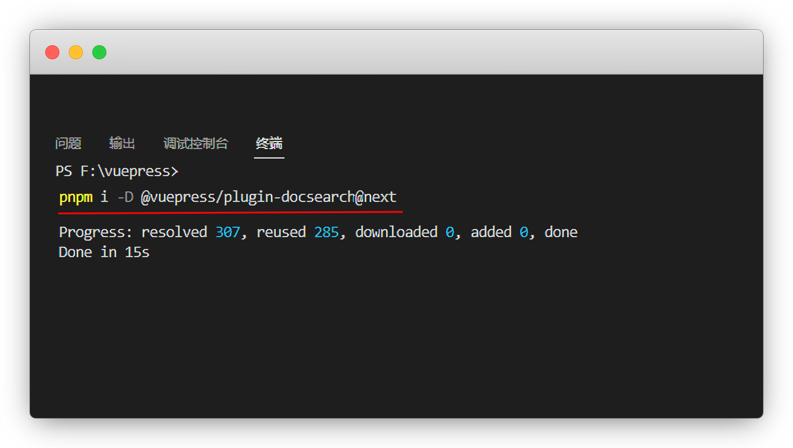
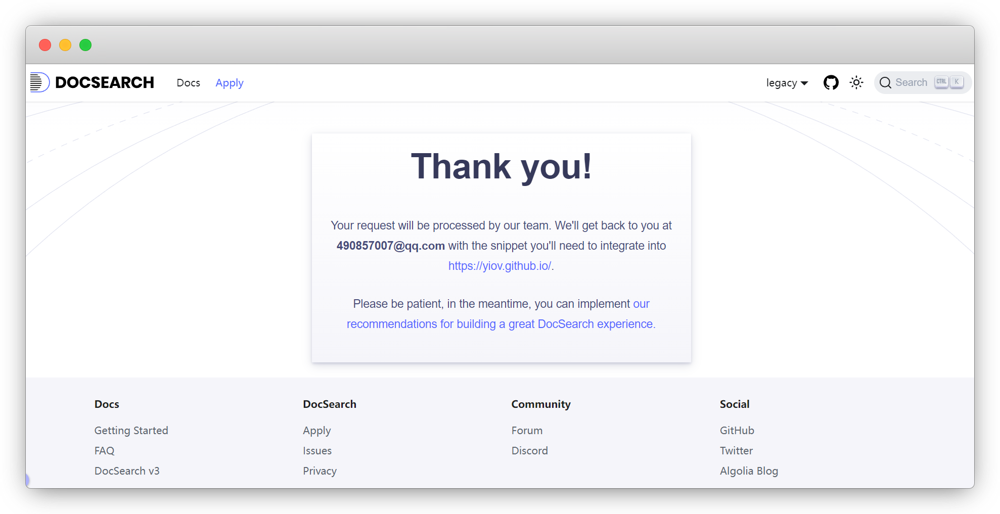
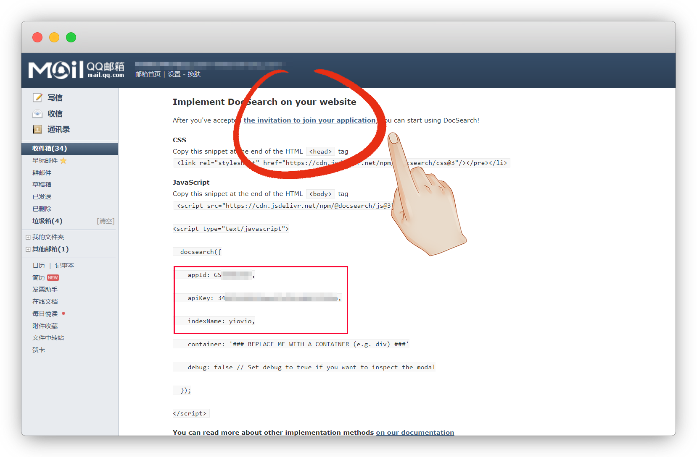
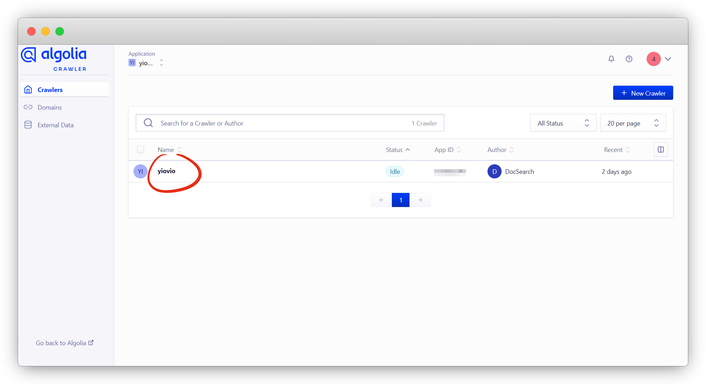
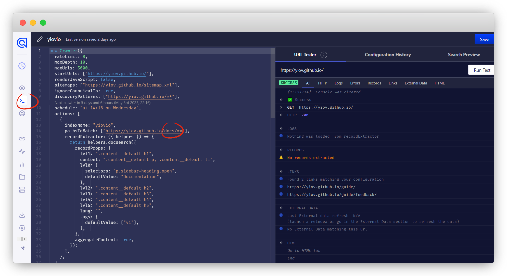
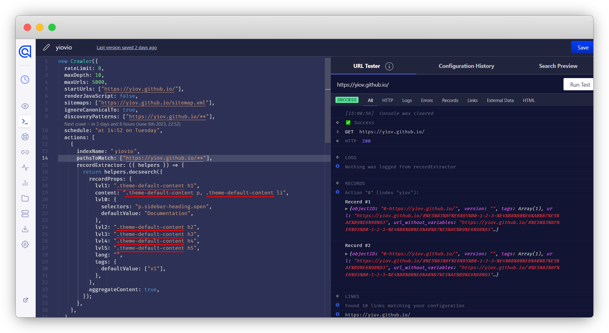
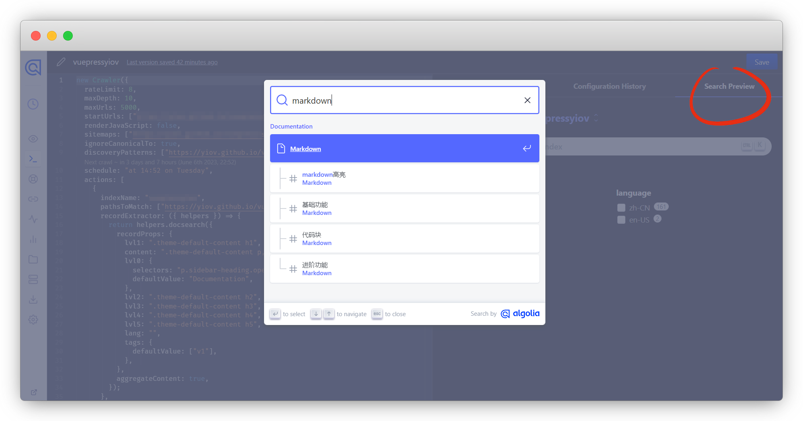
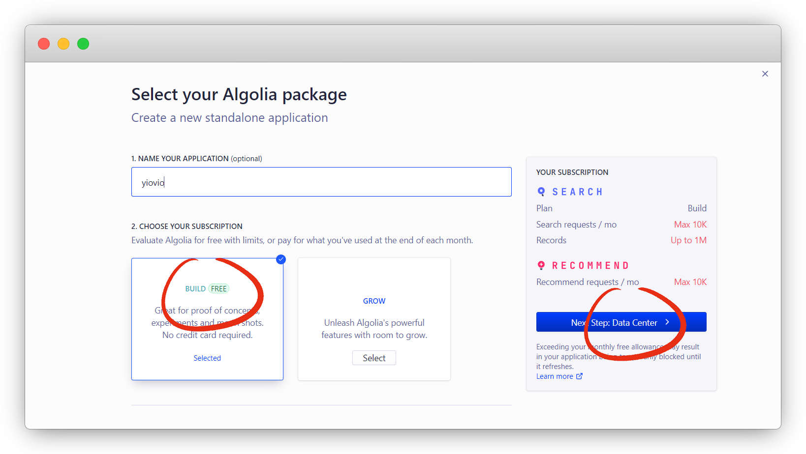
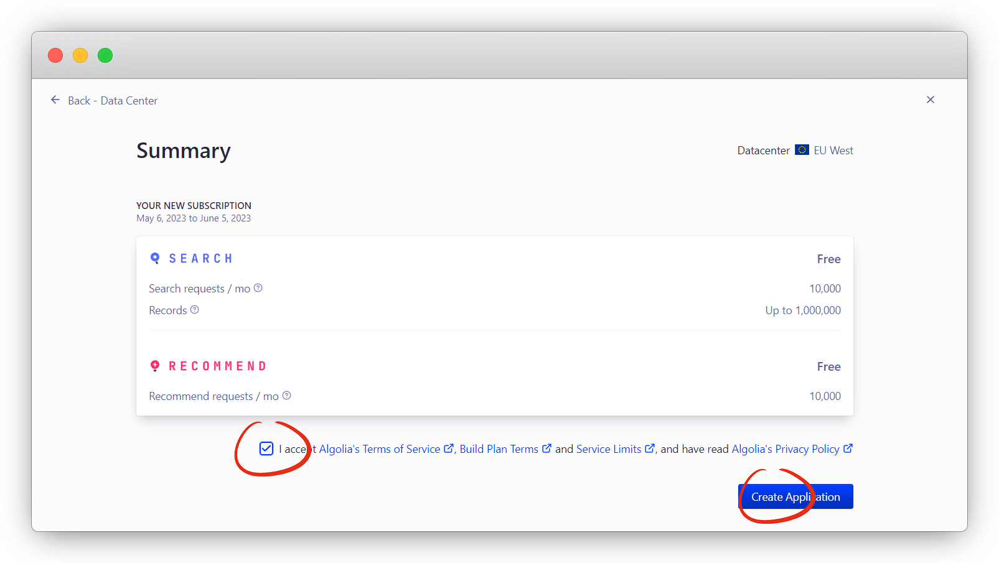
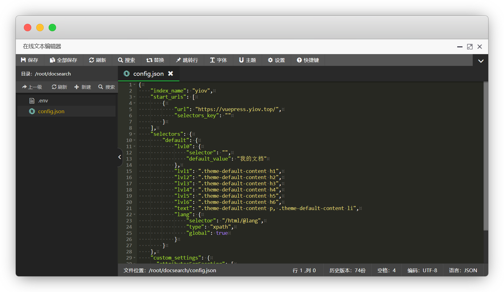

# DocSearch

> 最近更新：2023-11-17


## 安装

::: tip 说明
安装失败，挂个梯子就可以了
:::


:::: code-group
::: code-group-item pnpm
```sh
pnpm add -D @vuepress/plugin-docsearch@next
```
:::
::: code-group-item yarn
```sh
yarn add -D @vuepress/plugin-docsearch@next
```
:::
::: code-group-item npm
```sh
npm i -D @vuepress/plugin-docsearch@next
```
:::
::::





## 配置

然后在 `config.ts` 里添加配置

::: warning 注意
appId / apiKey / indexName 这3个我们等会获取了再填入
:::

```ts{7-9}
import { docsearchPlugin } from '@vuepress/plugin-docsearch'

export default {
  //========docsearch配置========//
  plugins: [
    docsearchPlugin({
      appId: '<Application ID>',
      apiKey: '<Search-Only API Key>',
      indexName: '<INDEX_NAME>',
      locales: {
        '/': {
          placeholder: '搜索文档',
          translations: {
            button: {
              buttonText: '搜索文档',
            },
          },
        },
        '/en/': {
          placeholder: 'Search Documentation',
          translations: {
            button: {
              buttonText: 'Search Documentation',
            },
          },
        },
      },
    }),
  ],
}
```

输出：


为了获取 `appId` / `apiKey` / `indexName`

在注册账号前，请先确定自己使用 [官方申请](#官方申请-选其一) 还是 [自建爬虫](#自建爬虫-选其一)


::: tip 区别
官方申请：可使用algolia官方的爬虫，但是需要提交公开仓库代码链接并通过

自建爬虫：需有一定动手能力，自行搭建爬虫，不需要提交仓库代码链接
:::


## 官方申请(选其一)


### 递交申请

DocSearch官网：[https://docsearch.algolia.com/](https://docsearch.algolia.com/)

点 `Apply` 申请，填入你的网址/邮箱/仓库链接即可


::: tip 说明
我点了2次都没有跳转，最后挂了个梯子可以了
:::




### 注册账号

等待6-7小时，邮件发送过来

没有注册过的会给我们一个邀请链接，打开并注册账号

::: warning 注意
这里的appid、indexname我们可以填入 `config.ts`

但是 apikey 这个没用，需要 `Search-Only API Key` 我们一会再填
:::



通过邀请链接注册并登录进[Algolia官网](https://www.algolia.com/)，点 `Search` - `index`

由于官方已经帮我们创建了 `Application` ，我们直接点接受即可

::: tip 说明
没有弹按钮的，去邮箱复制邀请链接打开就有了
:::


### 爬取数据

问题来了，这里的索引 `records` 值为0，没有数据，爬取数据有问题

::: tip 说明
点刷新看看，我点了也没有用
:::


登录官方爬虫后台进行调试：[https://crawler.algolia.com/](https://crawler.algolia.com/)

再点击官方帮我们申请的Application




点 `Overview` 进来后发现爬虫数据有的，但是Records没有值，说明数据逻辑有问题


点 `Editor` 进来发现了问题，这里多了一个 `/doc` 

::: warning 注意
除了指定位置，其他不要乱改，特别是apikey不要改！和你申请的apikey不是同一个用途

如果你网址有别名解析或者重定向了，就不能用了，只能用你申请时的网址
:::



改过之后点 `Runtest` 测试一下，records还是没有值

原来是class标签不对，用审查元素看了下page也的class是 theme-default-content


那我们将原来的 `.content_default` 全部替换成 `.theme-default-content` 即可




再次 `Run test`，可以在 Search Preview 里可以搜素看看




没问题了点保存，再重新在Overview重新爬取，Records有值就代表OK了


点击index回到algolia，看数据是否同步过来


最后，回到 查看API KEYS，这里我们将 `Search API Key` 填入 `config.ts` 


### 测试结果

本地搜索一下，可以使用了

::: tip 说明
如果还是不行，就对照 [vuepress文档](https://v2.vuepress.vuejs.org/zh/reference/plugin/docsearch.html#%E8%8E%B7%E5%8F%96%E6%90%9C%E7%B4%A2%E7%B4%A2%E5%BC%95) 挨个试

免费的东西自然是费脑筋
:::


## 自建爬虫(选其一)

有点耐心看，我都一步步截图了


### 注册账号

[Algolia官网](https://www.algolia.com/) 注册并登录账号

::: tip 说明
也可以只用github关联登录注册
:::


### 创建应用

注册好后，我们在设置里新建一个Application应用

::: tip 说明
系统会默认给我们建一个，也是可以用的
:::

创建一个新的应用程序 Applications - Create Application


名称随便，选择 `Free` 免费的方案，下一步

::: tip 说明
爬虫每月1万次，足够用了
:::



这里只能选择默认了，香港这些数据中心都不能选择

::: tip 说明
香港的只能通过申请，官方给你配，不过即便是美国实测搜索也慢不了多少
:::


勾选同意，创建即可



这样就完成了


### 创建索引

右下角创建索引，选择 Date Sources - Indices - Create Index


这个就是我们的索引名，即 indexName ，后面会用到


接下来就是准备好我们的API，上面选择创建的Application

选择 `API keys`

::: tip 说明
Application ID：应用ID

Search-Only API Key：搜索API

Admin API Key：管理API

indexName：索引名
:::


### 爬取数据

此方式仅适用于 [自建爬虫](#自建爬虫-选其一) ，不适用于 [官方申请](官方申请-选其一)

[Docker](#docker) 和 [Github Actions](#github-actions) 二选一，推荐使用 `Github Actions`


### Docker

::: warning 选其一
这个和 [Github Actions](#github-actions) 任选其一
:::

我用了 [虚拟机](https://yiov.top/website/VMware.html) 安装了 [docker](https://yiov.top/website/docker.html)，进 [宝塔](https://yiov.top/website/BT.html) 根目录 `root`文件夹

新建一个 `docsearch` 目录

::: tip 说明
名字随便，只要自己记得住就行
:::


新建一个 `.env` 环境变量文件，并填入相应值

```env
APPLICATION_ID=你的Application ID
API_KEY=你的Admin API Key(非Search)
```


安装 [jq](https://repology.org/project/jq/versions) 一款json解析工具

```sh
#安装jq
yum install jq -y

#版本查询
jq --version
```


在docsearch目录里新建 `config.json` 文件，用于爬虫的配置，根据提示修改好自己的链接

::: tip 说明
当时就是卡在这里了，网上的版本尝试了无数次都不行

于是对照着 [algolia官方旧文档](https://docsearch.algolia.com/docs/legacy/run-your-own/) 挨个试

最后审查元素发现，有个facetFliter里有个lang， 同时vuepress官方也指出 `attributesForFaceting` 必须包含 `lang` 否则无法使用


:::


```json{2,5,32}
{
    "index_name": "你的索引名",
    "start_urls": [
        {
            "url": "https://你的网址.com/",
            "selectors_key": ""
        }
    ],
    "stop_urls": [],
    "selectors": {
        "default": {
            "lvl0": {
                "selector": "",
                "default_value": "我的文档"
            },
            "lvl1": ".theme-default-content h1",
            "lvl2": ".theme-default-content h2",
            "lvl3": ".theme-default-content h3",
            "lvl4": ".theme-default-content h4",
            "lvl5": ".theme-default-content h5",
            "lvl6": ".theme-default-content h6",
            "text": ".theme-default-content p, .theme-default-content li",
            "lang": {
                "selector": "/html/@lang",
                "type": "xpath",
                "global": true
            }
        }
    },
    "custom_settings": {
        "attributesForFaceting": [
            "lang"
        ]
    }
}
```


只需要修改 `index_name` 和 `startUrls` 其余选项可保持默认

::: tip 说明
`stop_urls` 表示的是爬虫不爬取的链接
:::





至此我们的前期工作就准备好了，开始爬数据


现在我们拉取镜像并运行爬虫


::: tip 说明
格式：docker run -it --env-file=`你的env路径` -e "CONFIG=$(cat `你的配置json路径` | jq -r tostring)" algolia/docsearch-scraper`

比如我，都放在了root目录里的docsearch文件夹里，自己按需修改文件路径
:::

```sh
docker run -it --env-file=/root/docsearch/.env -e "CONFIG=$(cat /root/docsearch/config.json | jq -r tostring)" algolia/docsearch-scraper
```


回到Algolia看到数据已经有了

::: warning 注意
这里成功了会有个 `lang：zh_CN`，否则有数据也用不了
:::


在 `config.ts` 填上数据后，搜索一次看下成果


### Github Actions


::: warning 推荐
这个和 [Docker爬取数据](#docker) 任选其一
:::


我们先在仓库 - 设置 - Secrets and variables - actions，新增仓库秘钥


分别添加 `APPLICATION_ID` 和 `API_KEY`

::: warning 千万不要填错了
`APPLICATION_ID` 是 [algolia的 APPLICATION ID](https://www.algolia.com/)

`API_KEY` 是 [algolia的 Admin API Key](https://www.algolia.com/)
:::


然后在根目录新建一个 `docsearch.json` 文件，复制粘贴并提交


::: tip 说明
只需要修改 `index_name` 和 `startUrls` 其余选项可保持默认


`stop_urls` 表示的是爬虫不爬取的链接
:::


```json{2,5,32}
{
    "index_name": "你的索引名",
    "start_urls": [
        {
            "url": "https://你的网址.com/",
            "selectors_key": ""
        }
    ],
    "stop_urls": [],
    "selectors": {
        "default": {
            "lvl0": {
                "selector": "",
                "default_value": "我的文档"
            },
            "lvl1": ".theme-default-content h1",
            "lvl2": ".theme-default-content h2",
            "lvl3": ".theme-default-content h3",
            "lvl4": ".theme-default-content h4",
            "lvl5": ".theme-default-content h5",
            "lvl6": ".theme-default-content h6",
            "text": ".theme-default-content p, .theme-default-content li",
            "lang": {
                "selector": "/html/@lang",
                "type": "xpath",
                "global": true
            }
        }
    },
    "custom_settings": {
        "attributesForFaceting": [
            "lang"
        ]
    }
}
```


最后，创建一个工作流

::: tip 说明
我因为已经有一个了，我直接新建一个就行
:::


命名为`docsearch.yml` ，复制粘贴下面的工作流代码，提交


```yml{4-8}
# 名字可以自己取
name: docsearch

# 提交main分支触发部署
on:
  push:
    branches:
      - main

jobs:
  algolia:
    runs-on: ubuntu-latest
    steps:
      - uses: actions/checkout@v2

      # 一会要建docsearch.json文件
      - name: Get the content of docsearch.json as config
        id: algolia_config
        run: echo "::set-output name=config::$(cat docsearch.json | jq -r tostring)"

      - name: Run algolia/docsearch-scraper image
        # 环境变量 ，在仓库设置-安全里添加秘钥
        # APPLICATION_ID 是 algoia 的 APPLICATION ID
        # API_KEY 是 algolia 的 Admin API KEY
        # CONFIG默认即可，无需更改
        env:
          APPLICATION_ID: ${{ secrets.APPLICATION_ID }}
          API_KEY: ${{ secrets.API_KEY }}
          CONFIG: ${{ steps.algolia_config.outputs.config }}
        run: |
          docker run \
            --env APPLICATION_ID=${APPLICATION_ID} \
            --env API_KEY=${API_KEY} \
            --env "CONFIG=${CONFIG}" \
            algolia/docsearch-scraper

```

::: warning 注意
把注释都删掉

触发的条件自己选，改代码高亮的位置就行，其他不要动
:::

:::: code-group
::: code-group-item 发布后触发
```yml
on: deployment
```
:::
::: code-group-item 提交后触发
```yml
on:
  push:
    branches:
      - main
```
:::
::: code-group-item 定时触发
```yml
on:
  schedule:
    # 约每天早上8点触发（UTC时间0点）
    - cron: '0 0 * * *'
```
:::
::: code-group-item 手动触发
```yml
on:
  workflow_dispatch:
```
:::
::::


### 测试结果

我们提交一次代码，等工作流跑完，我们试试搜索结果


## 样式美化

你可以通过 [@docsearch/css](https://docsearch.algolia.com/docs/styling/) 提供的 CSS 变量来自定义样式

如果你不懂方法，[可以参照样式美化的方法](./beautification)

```css
:root {
  --docsearch-primary-color: rgb(84, 104, 255);
  --docsearch-text-color: rgb(28, 30, 33);
  --docsearch-spacing: 12px;
  --docsearch-icon-stroke-width: 1.4;
  --docsearch-highlight-color: var(--docsearch-primary-color);
  --docsearch-muted-color: rgb(150, 159, 175);
  --docsearch-container-background: rgba(101, 108, 133, 0.8);
  --docsearch-logo-color: rgba(84, 104, 255);

  /* modal */
  --docsearch-modal-width: 560px;
  --docsearch-modal-height: 600px;
  --docsearch-modal-background: rgb(245, 246, 247);
  --docsearch-modal-shadow: inset 1px 1px 0 0 rgba(255, 255, 255, 0.5), 0 3px
      8px 0 rgba(85, 90, 100, 1);

  /* searchbox */
  --docsearch-searchbox-height: 56px;
  --docsearch-searchbox-background: rgb(235, 237, 240);
  --docsearch-searchbox-focus-background: #fff;
  --docsearch-searchbox-shadow: inset 0 0 0 2px var(--docsearch-primary-color);

  /* hit */
  --docsearch-hit-height: 56px;
  --docsearch-hit-color: rgb(68, 73, 80);
  --docsearch-hit-active-color: #fff;
  --docsearch-hit-background: #fff;
  --docsearch-hit-shadow: 0 1px 3px 0 rgb(212, 217, 225);

  /* key */
  --docsearch-key-gradient: linear-gradient(
    -225deg,
    rgb(213, 219, 228) 0%,
    rgb(248, 248, 248) 100%
  );
  --docsearch-key-shadow: inset 0 -2px 0 0 rgb(205, 205, 230), inset 0 0 1px 1px
      #fff, 0 1px 2px 1px rgba(30, 35, 90, 0.4);

  /* footer */
  --docsearch-footer-height: 44px;
  --docsearch-footer-background: #fff;
  --docsearch-footer-shadow: 0 -1px 0 0 rgb(224, 227, 232), 0 -3px 6px 0 rgba(69, 98, 155, 0.12);
}
```


## 索引美化

这是官网原文档的索引，有明显的分类，很美观


### 官方爬虫优化

经过对 [Algolia官方文档](https://docsearch.algolia.com/docs/templates) 进行查阅，找到了方法

::: warning 注意
为了更直观的讲解，我贴出自己的部分索引规则

---

修改前请先备份，以免无法找回使用
:::

```js{6-8,15,17-18,26,34,43,51,59,70}
new Crawler({
  rateLimit: 8,
  maxDepth: 10,
  maxUrls: 5000,
  startUrls: [
    "https://yiov.github.io/",
    "https://yiov.github.io/guide/",
    "https://yiov.github.io/guide/getting-started.html"
  ],
  renderJavaScript: false,
  sitemaps: ["https://yiov.github.io/sitemap.xml"],
  ignoreCanonicalTo: true,
  discoveryPatterns: ["https://yiov.github.io/**"],
  schedule: "at 14:52 on Tuesday",
  actions: [
    {
      indexName: "vuepressyiov",
      pathsToMatch: ["https://yiov.github.io/guide/"],
      recordExtractor: ({ helpers }) => {
        return helpers.docsearch({
          recordProps: {
            lvl1: ".theme-default-content h1",
            content: ".theme-default-content p, .theme-default-content li",
            lvl0: {
              selectors: "p.sidebar-heading.open",
              defaultValue: "前言",
            },
            lvl2: ".theme-default-content h2",
            lvl3: ".theme-default-content h3",
            lvl4: ".theme-default-content h4",
            lvl5: ".theme-default-content h5",
            lang: "",
            tags: {
              defaultValue: ["guide"],
            },
          },
          aggregateContent: true,
        });
      },
    },
    {
      indexName: "vuepressyiov",
      pathsToMatch: ["https://yiov.github.io/guide/getting-started.html"],
      recordExtractor: ({ helpers }) => {
        return helpers.docsearch({
          recordProps: {
            lvl1: ".theme-default-content h1",
            content: ".theme-default-content p, .theme-default-content li",
            lvl0: {
              selectors: "p.sidebar-heading.open",
              defaultValue: "快速上手",
            },
            lvl2: ".theme-default-content h2",
            lvl3: ".theme-default-content h3",
            lvl4: ".theme-default-content h4",
            lvl5: ".theme-default-content h5",
            lang: "",
            tags: {
              defaultValue: ["getting-started"],
            },
          },
          aggregateContent: true,
        });
      },
    },
  ],
  safetyChecks: { beforeIndexPublishing: { maxLostRecordsPercentage: 30 } },
  initialIndexSettings: {
    vuepressyiov: {
      attributesForFaceting: ["type", "lang", "language", "version", "tags"],
      attributesToRetrieve: [
        "hierarchy",
        "content",
        "anchor",
        "url",
        "url_without_anchor",
        "type",
      ],
      attributesToHighlight: ["hierarchy", "hierarchy_camel", "content"],
      attributesToSnippet: ["content:10"],
      camelCaseAttributes: ["hierarchy", "hierarchy_radio", "content"],
      searchableAttributes: [
        "unordered(hierarchy_radio_camel.lvl0)",
        "unordered(hierarchy_radio.lvl0)",
        "unordered(hierarchy_radio_camel.lvl1)",
        "unordered(hierarchy_radio.lvl1)",
        "unordered(hierarchy_radio_camel.lvl2)",
        "unordered(hierarchy_radio.lvl2)",
        "unordered(hierarchy_radio_camel.lvl3)",
        "unordered(hierarchy_radio.lvl3)",
        "unordered(hierarchy_radio_camel.lvl4)",
        "unordered(hierarchy_radio.lvl4)",
        "unordered(hierarchy_radio_camel.lvl5)",
        "unordered(hierarchy_radio.lvl5)",
        "unordered(hierarchy_radio_camel.lvl6)",
        "unordered(hierarchy_radio.lvl6)",
        "unordered(hierarchy_camel.lvl0)",
        "unordered(hierarchy.lvl0)",
        "unordered(hierarchy_camel.lvl1)",
        "unordered(hierarchy.lvl1)",
        "unordered(hierarchy_camel.lvl2)",
        "unordered(hierarchy.lvl2)",
        "unordered(hierarchy_camel.lvl3)",
        "unordered(hierarchy.lvl3)",
        "unordered(hierarchy_camel.lvl4)",
        "unordered(hierarchy.lvl4)",
        "unordered(hierarchy_camel.lvl5)",
        "unordered(hierarchy.lvl5)",
        "unordered(hierarchy_camel.lvl6)",
        "unordered(hierarchy.lvl6)",
        "content",
      ],
      distinct: true,
      attributeForDistinct: "url",
      customRanking: [
        "desc(weight.pageRank)",
        "desc(weight.level)",
        "asc(weight.position)",
      ],
      ranking: [
        "words",
        "filters",
        "typo",
        "attribute",
        "proximity",
        "exact",
        "custom",
      ],
      highlightPreTag: '<span class="algolia-docsearch-suggestion--highlight">',
      highlightPostTag: "</span>",
      minWordSizefor1Typo: 3,
      minWordSizefor2Typos: 7,
      allowTyposOnNumericTokens: false,
      minProximity: 1,
      ignorePlurals: true,
      advancedSyntax: true,
      attributeCriteriaComputedByMinProximity: true,
      removeWordsIfNoResults: "allOptional",
    },
  },
  appId: "F6RYJMVN8K",
  apiKey: "自动填入的勿改",
});
```

::: tip 讲解
startUrls：除了主域名，还可以加入其它页面的链接，方便后面进行分类

actions：是我们分类的关键参数

indexName：索引名

pathsToMatch：参数匹配，分别填我们的分页链接

defaultValue：分页标签名

tags：分页标签

attributesForFaceting：页面属性，`lang`和`tags`至关重要，不填即便爬了数据也搜不到

其它参数均默认即可
:::


::: details 点击查看 我的完整索引配置
```js
new Crawler({
  rateLimit: 8,
  maxDepth: 10,
  maxUrls: 5000,
  startUrls: [
    "https://yiov.github.io/",
    "https://yiov.github.io/guide/",
    "https://yiov.github.io/guide/getting-started.html",
    "https://yiov.github.io/guide/configuration.html",
    "https://yiov.github.io/guide/page.html",
    "https://yiov.github.io/guide/frontmatter.html",
    "https://yiov.github.io/guide/markdown.html",
    "https://yiov.github.io/guide/assets.html",
    "https://yiov.github.io/guide/beautification.html",
    "https://yiov.github.io/guide/docsearch.html",
    "https://yiov.github.io/guide/plugin.html",
    "https://yiov.github.io/guide/components.html",
    "https://yiov.github.io/guide/update.html"
  ],
  renderJavaScript: false,
  sitemaps: ["https://yiov.github.io/sitemap.xml"],
  ignoreCanonicalTo: true,
  discoveryPatterns: ["https://yiov.github.io/**"],
  schedule: "at 14:52 on Tuesday",
  actions: [
    {
      indexName: "vuepressyiov",
      pathsToMatch: ["https://yiov.github.io/guide/"],
      recordExtractor: ({ helpers }) => {
        return helpers.docsearch({
          recordProps: {
            lvl1: ".theme-default-content h1",
            content: ".theme-default-content p, .theme-default-content li",
            lvl0: {
              selectors: "p.sidebar-heading.open",
              defaultValue: "前言",
            },
            lvl2: ".theme-default-content h2",
            lvl3: ".theme-default-content h3",
            lvl4: ".theme-default-content h4",
            lvl5: ".theme-default-content h5",
            lang: "",
            tags: {
              defaultValue: ["guide"],
            },
          },
          aggregateContent: true,
        });
      },
    },
    {
      indexName: "vuepressyiov",
      pathsToMatch: ["https://yiov.github.io/guide/getting-started.html"],
      recordExtractor: ({ helpers }) => {
        return helpers.docsearch({
          recordProps: {
            lvl1: ".theme-default-content h1",
            content: ".theme-default-content p, .theme-default-content li",
            lvl0: {
              selectors: "p.sidebar-heading.open",
              defaultValue: "快速上手",
            },
            lvl2: ".theme-default-content h2",
            lvl3: ".theme-default-content h3",
            lvl4: ".theme-default-content h4",
            lvl5: ".theme-default-content h5",
            lang: "",
            tags: {
              defaultValue: ["getting-started"],
            },
          },
          aggregateContent: true,
        });
      },
    },
    {
      indexName: "vuepressyiov",
      pathsToMatch: ["https://yiov.github.io/guide/configuration.html"],
      recordExtractor: ({ helpers }) => {
        return helpers.docsearch({
          recordProps: {
            lvl1: ".theme-default-content h1",
            content: ".theme-default-content p, .theme-default-content li",
            lvl0: {
              selectors: "p.sidebar-heading.open",
              defaultValue: "配置",
            },
            lvl2: ".theme-default-content h2",
            lvl3: ".theme-default-content h3",
            lvl4: ".theme-default-content h4",
            lvl5: ".theme-default-content h5",
            lang: "",
            tags: {
              defaultValue: ["configuration"],
            },
          },
          aggregateContent: true,
        });
      },
    },
    {
      indexName: "vuepressyiov",
      pathsToMatch: ["https://yiov.github.io/guide/page.html"],
      recordExtractor: ({ helpers }) => {
        return helpers.docsearch({
          recordProps: {
            lvl1: ".theme-default-content h1",
            content: ".theme-default-content p, .theme-default-content li",
            lvl0: {
              selectors: "p.sidebar-heading.open",
              defaultValue: "页面",
            },
            lvl2: ".theme-default-content h2",
            lvl3: ".theme-default-content h3",
            lvl4: ".theme-default-content h4",
            lvl5: ".theme-default-content h5",
            lang: "",
            tags: {
              defaultValue: ["page"],
            },
          },
          aggregateContent: true,
        });
      },
    },
    {
      indexName: "vuepressyiov",
      pathsToMatch: ["https://yiov.github.io/guide/frontmatter.html"],
      recordExtractor: ({ helpers }) => {
        return helpers.docsearch({
          recordProps: {
            lvl1: ".theme-default-content h1",
            content: ".theme-default-content p, .theme-default-content li",
            lvl0: {
              selectors: "p.sidebar-heading.open",
              defaultValue: "Frontmatter",
            },
            lvl2: ".theme-default-content h2",
            lvl3: ".theme-default-content h3",
            lvl4: ".theme-default-content h4",
            lvl5: ".theme-default-content h5",
            lang: "",
            tags: {
              defaultValue: ["frontmatter"],
            },
          },
          aggregateContent: true,
        });
      },
    },
    {
      indexName: "vuepressyiov",
      pathsToMatch: ["https://yiov.github.io/guide/markdown.html"],
      recordExtractor: ({ helpers }) => {
        return helpers.docsearch({
          recordProps: {
            lvl1: ".theme-default-content h1",
            content: ".theme-default-content p, .theme-default-content li",
            lvl0: {
              selectors: "p.sidebar-heading.open",
              defaultValue: "Markdown",
            },
            lvl2: ".theme-default-content h2",
            lvl3: ".theme-default-content h3",
            lvl4: ".theme-default-content h4",
            lvl5: ".theme-default-content h5",
            lang: "",
            tags: {
              defaultValue: ["markdown"],
            },
          },
          aggregateContent: true,
        });
      },
    },
    {
      indexName: "vuepressyiov",
      pathsToMatch: ["https://yiov.github.io/guide/assets.html"],
      recordExtractor: ({ helpers }) => {
        return helpers.docsearch({
          recordProps: {
            lvl1: ".theme-default-content h1",
            content: ".theme-default-content p, .theme-default-content li",
            lvl0: {
              selectors: "p.sidebar-heading.open",
              defaultValue: "静态部署",
            },
            lvl2: ".theme-default-content h2",
            lvl3: ".theme-default-content h3",
            lvl4: ".theme-default-content h4",
            lvl5: ".theme-default-content h5",
            lang: "",
            tags: {
              defaultValue: ["assets"],
            },
          },
          aggregateContent: true,
        });
      },
    },
    {
      indexName: "vuepressyiov",
      pathsToMatch: ["https://yiov.github.io/guide/beautification.html"],
      recordExtractor: ({ helpers }) => {
        return helpers.docsearch({
          recordProps: {
            lvl1: ".theme-default-content h1",
            content: ".theme-default-content p, .theme-default-content li",
            lvl0: {
              selectors: "p.sidebar-heading.open",
              defaultValue: "样式美化",
            },
            lvl2: ".theme-default-content h2",
            lvl3: ".theme-default-content h3",
            lvl4: ".theme-default-content h4",
            lvl5: ".theme-default-content h5",
            lang: "",
            tags: {
              defaultValue: ["beautification"],
            },
          },
          aggregateContent: true,
        });
      },
    },
    {
      indexName: "vuepressyiov",
      pathsToMatch: ["https://yiov.github.io/guide/docsearch.html"],
      recordExtractor: ({ helpers }) => {
        return helpers.docsearch({
          recordProps: {
            lvl1: ".theme-default-content h1",
            content: ".theme-default-content p, .theme-default-content li",
            lvl0: {
              selectors: "p.sidebar-heading.open",
              defaultValue: "Docsearch",
            },
            lvl2: ".theme-default-content h2",
            lvl3: ".theme-default-content h3",
            lvl4: ".theme-default-content h4",
            lvl5: ".theme-default-content h5",
            lang: "",
            tags: {
              defaultValue: ["docsearch"],
            },
          },
          aggregateContent: true,
        });
      },
    },
    {
      indexName: "vuepressyiov",
      pathsToMatch: ["https://yiov.github.io/guide/plugin.html"],
      recordExtractor: ({ helpers }) => {
        return helpers.docsearch({
          recordProps: {
            lvl1: ".theme-default-content h1",
            content: ".theme-default-content p, .theme-default-content li",
            lvl0: {
              selectors: "p.sidebar-heading.open",
              defaultValue: "插件",
            },
            lvl2: ".theme-default-content h2",
            lvl3: ".theme-default-content h3",
            lvl4: ".theme-default-content h4",
            lvl5: ".theme-default-content h5",
            lang: "",
            tags: {
              defaultValue: ["plugin"],
            },
          },
          aggregateContent: true,
        });
      },
    },
    {
      indexName: "vuepressyiov",
      pathsToMatch: ["https://yiov.github.io/guide/components.html"],
      recordExtractor: ({ helpers }) => {
        return helpers.docsearch({
          recordProps: {
            lvl1: ".theme-default-content h1",
            content: ".theme-default-content p, .theme-default-content li",
            lvl0: {
              selectors: "p.sidebar-heading.open",
              defaultValue: "组件",
            },
            lvl2: ".theme-default-content h2",
            lvl3: ".theme-default-content h3",
            lvl4: ".theme-default-content h4",
            lvl5: ".theme-default-content h5",
            lang: "",
            tags: {
              defaultValue: ["components"],
            },
          },
          aggregateContent: true,
        });
      },
    },
    {
      indexName: "vuepressyiov",
      pathsToMatch: ["https://yiov.github.io/guide/update.html"],
      recordExtractor: ({ helpers }) => {
        return helpers.docsearch({
          recordProps: {
            lvl1: ".theme-default-content h1",
            content: ".theme-default-content p, .theme-default-content li",
            lvl0: {
              selectors: "p.sidebar-heading.open",
              defaultValue: "更新及卸载",
            },
            lvl2: ".theme-default-content h2",
            lvl3: ".theme-default-content h3",
            lvl4: ".theme-default-content h4",
            lvl5: ".theme-default-content h5",
            lang: "",
            tags: {
              defaultValue: ["update"],
            },
          },
          aggregateContent: true,
        });
      },
    },
  ],
  safetyChecks: { beforeIndexPublishing: { maxLostRecordsPercentage: 30 } },
  initialIndexSettings: {
    vuepressyiov: {
      attributesForFaceting: ["type", "lang", "language", "version", "tags"],
      attributesToRetrieve: [
        "hierarchy",
        "content",
        "anchor",
        "url",
        "url_without_anchor",
        "type",
      ],
      attributesToHighlight: ["hierarchy", "hierarchy_camel", "content"],
      attributesToSnippet: ["content:10"],
      camelCaseAttributes: ["hierarchy", "hierarchy_radio", "content"],
      searchableAttributes: [
        "unordered(hierarchy_radio_camel.lvl0)",
        "unordered(hierarchy_radio.lvl0)",
        "unordered(hierarchy_radio_camel.lvl1)",
        "unordered(hierarchy_radio.lvl1)",
        "unordered(hierarchy_radio_camel.lvl2)",
        "unordered(hierarchy_radio.lvl2)",
        "unordered(hierarchy_radio_camel.lvl3)",
        "unordered(hierarchy_radio.lvl3)",
        "unordered(hierarchy_radio_camel.lvl4)",
        "unordered(hierarchy_radio.lvl4)",
        "unordered(hierarchy_radio_camel.lvl5)",
        "unordered(hierarchy_radio.lvl5)",
        "unordered(hierarchy_radio_camel.lvl6)",
        "unordered(hierarchy_radio.lvl6)",
        "unordered(hierarchy_camel.lvl0)",
        "unordered(hierarchy.lvl0)",
        "unordered(hierarchy_camel.lvl1)",
        "unordered(hierarchy.lvl1)",
        "unordered(hierarchy_camel.lvl2)",
        "unordered(hierarchy.lvl2)",
        "unordered(hierarchy_camel.lvl3)",
        "unordered(hierarchy.lvl3)",
        "unordered(hierarchy_camel.lvl4)",
        "unordered(hierarchy.lvl4)",
        "unordered(hierarchy_camel.lvl5)",
        "unordered(hierarchy.lvl5)",
        "unordered(hierarchy_camel.lvl6)",
        "unordered(hierarchy.lvl6)",
        "content",
      ],
      distinct: true,
      attributeForDistinct: "url",
      customRanking: [
        "desc(weight.pageRank)",
        "desc(weight.level)",
        "asc(weight.position)",
      ],
      ranking: [
        "words",
        "filters",
        "typo",
        "attribute",
        "proximity",
        "exact",
        "custom",
      ],
      highlightPreTag: '<span class="algolia-docsearch-suggestion--highlight">',
      highlightPostTag: "</span>",
      minWordSizefor1Typo: 3,
      minWordSizefor2Typos: 7,
      allowTyposOnNumericTokens: false,
      minProximity: 1,
      ignorePlurals: true,
      advancedSyntax: true,
      attributeCriteriaComputedByMinProximity: true,
      removeWordsIfNoResults: "allOptional",
    },
  },
  appId: "F6RYJMVN8K",
  apiKey: "eca1301dfef30f54242731fdca1f7aed",
});
```
:::


### 自建爬虫优化

经过对 [Algolia官方文档](https://docsearch.algolia.com/docs/legacy/config-file/) 进行查阅，找到了方法


::: warning 注意
为了更直观的讲解，我贴出自己的部分索引规则

---

修改前请先备份，以免无法找回使用
:::


```json{2,5-7,18,21,39,57,75-76}
{
    "index_name": "yiov",
    "start_urls": [
        {
            "url": "https://vuepress.yiov.top/guide/getting-started.html",
            "selectors_key": "getting-started",
            "tags": ["getting-started"]
        },
        {
            "url": "https://vuepress.yiov.top/guide/configuration.html",
            "selectors_key": "configuration",
            "tags": ["configuration"]
        },
        "https://vuepress.yiov.top/"
    ],
    "stop_urls": [""],
    "selectors": {
        "getting-started": {
            "lvl0": {
                "selector": "",
                "default_value": "快速上手"
            },
            "lvl1": ".theme-default-content h1",
            "lvl2": ".theme-default-content h2",
            "lvl3": ".theme-default-content h3",
            "lvl4": ".theme-default-content h4",
            "lvl5": ".theme-default-content h5",
            "lvl6": ".theme-default-content h6",
            "text": ".theme-default-content p, .theme-default-content li",
            "lang": {
                "selector": "/html/@lang",
                "type": "xpath",
                "global": true
            }
        },
        "configuration": {
            "lvl0": {
                "selector": "",
                "default_value": "配置"
            },
            "lvl1": ".theme-default-content h1",
            "lvl2": ".theme-default-content h2",
            "lvl3": ".theme-default-content h3",
            "lvl4": ".theme-default-content h4",
            "lvl5": ".theme-default-content h5",
            "lvl6": ".theme-default-content h6",
            "text": ".theme-default-content p, .theme-default-content li",
            "lang": {
                "selector": "/html/@lang",
                "type": "xpath",
                "global": true
            }
        },
        "default": {
            "lvl0": {
                "selector": "",
                "default_value": "前言"
            },
            "lvl1": ".theme-default-content h1",
            "lvl2": ".theme-default-content h2",
            "lvl3": ".theme-default-content h3",
            "lvl4": ".theme-default-content h4",
            "lvl5": ".theme-default-content h5",
            "lvl6": ".theme-default-content h6",
            "text": ".theme-default-content p, .theme-default-content li",
            "lang": {
                "selector": "/html/@lang",
                "type": "xpath",
                "global": true
            }
        }
    },
    "custom_settings": {
      "attributesForFaceting": [
        "lang",
        "tags"
      ]
    }
}
```

::: tip 说明
index_name：索引名

start_urls：爬取链接，可以通过 `selectors_key` 和 `tags` 进行分类

selectors_key：分页的关键词

tags：分页标签

page_rank：分页搜索排序，数字1最大

stop_urls：禁止爬取的链接

default：默认分类，必须有，否则无法爬取

default_value：分类后默认显示的值

attributesForFaceting：分页属性，必须包含 `tags` 和 `lang`，否则即使爬取了数据也无法搜索
:::


::: details 点击查看 我的完整的索引配置
```json
{
    "index_name": "yiov",
    "start_urls": [
        {
            "url": "https://vuepress.yiov.top/guide/getting-started.html",
            "selectors_key": "getting-started",
            "tags": ["getting-started"]
        },
        {
            "url": "https://vuepress.yiov.top/guide/configuration.html",
            "selectors_key": "configuration",
            "tags": ["configuration"]
        },
        {
            "url": "https://vuepress.yiov.top/guide/page.html",
            "selectors_key": "page",
            "tags": ["page"]
        },
        {
            "url": "https://vuepress.yiov.top/guide/frontmatter.html",
            "selectors_key": "frontmatter",
            "tags": ["frontmatter"]
        },
        {
            "url": "https://vuepress.yiov.top/guide/markdown.html",
            "selectors_key": "markdown",
            "tags": ["markdown"]
        },
        {
            "url": "https://vuepress.yiov.top/guide/assets.html",
            "selectors_key": "assets",
            "tags": ["assets"]
        },
        {
            "url": "https://vuepress.yiov.top/guide/beautification.html",
            "selectors_key": "beautification",
            "tags": ["beautification"]
        },
        {
            "url": "https://vuepress.yiov.top/guide/docsearch.html",
            "selectors_key": "docsearch",
            "tags": ["docsearch"]
        },
        {
            "url": "https://vuepress.yiov.top/guide/plugin.html",
            "selectors_key": "plugin",
            "tags": ["plugin"]
        },
        {
            "url": "https://vuepress.yiov.top/guide/components.html",
            "selectors_key": "components",
            "tags": ["components"]
        },
        "https://vuepress.yiov.top/"
    ],
    "selectors": {
        "getting-started": {
            "lvl0": {
                "selector": "",
                "default_value": "快速上手"
            },
            "lvl1": ".theme-default-content h1",
            "lvl2": ".theme-default-content h2",
            "lvl3": ".theme-default-content h3",
            "lvl4": ".theme-default-content h4",
            "lvl5": ".theme-default-content h5",
            "lvl6": ".theme-default-content h6",
            "text": ".theme-default-content p, .theme-default-content li",
            "lang": {
                "selector": "/html/@lang",
                "type": "xpath",
                "global": true
            }
        },
        "configuration": {
            "lvl0": {
                "selector": "",
                "default_value": "配置"
            },
            "lvl1": ".theme-default-content h1",
            "lvl2": ".theme-default-content h2",
            "lvl3": ".theme-default-content h3",
            "lvl4": ".theme-default-content h4",
            "lvl5": ".theme-default-content h5",
            "lvl6": ".theme-default-content h6",
            "text": ".theme-default-content p, .theme-default-content li",
            "lang": {
                "selector": "/html/@lang",
                "type": "xpath",
                "global": true
            }
        },
        "page": {
            "lvl0": {
                "selector": "",
                "default_value": "页面"
            },
            "lvl1": ".theme-default-content h1",
            "lvl2": ".theme-default-content h2",
            "lvl3": ".theme-default-content h3",
            "lvl4": ".theme-default-content h4",
            "lvl5": ".theme-default-content h5",
            "lvl6": ".theme-default-content h6",
            "text": ".theme-default-content p, .theme-default-content li",
            "lang": {
                "selector": "/html/@lang",
                "type": "xpath",
                "global": true
            }
        },
        "frontmatter": {
            "lvl0": {
                "selector": "",
                "default_value": "Frontmatter"
            },
            "lvl1": ".theme-default-content h1",
            "lvl2": ".theme-default-content h2",
            "lvl3": ".theme-default-content h3",
            "lvl4": ".theme-default-content h4",
            "lvl5": ".theme-default-content h5",
            "lvl6": ".theme-default-content h6",
            "text": ".theme-default-content p, .theme-default-content li",
            "lang": {
                "selector": "/html/@lang",
                "type": "xpath",
                "global": true
            }
        },
        "markdown": {
            "lvl0": {
                "selector": "",
                "default_value": "Markdown"
            },
            "lvl1": ".theme-default-content h1",
            "lvl2": ".theme-default-content h2",
            "lvl3": ".theme-default-content h3",
            "lvl4": ".theme-default-content h4",
            "lvl5": ".theme-default-content h5",
            "lvl6": ".theme-default-content h6",
            "text": ".theme-default-content p, .theme-default-content li",
            "lang": {
                "selector": "/html/@lang",
                "type": "xpath",
                "global": true
            }
        },
        "assets": {
            "lvl0": {
                "selector": "",
                "default_value": "静态部署"
            },
            "lvl1": ".theme-default-content h1",
            "lvl2": ".theme-default-content h2",
            "lvl3": ".theme-default-content h3",
            "lvl4": ".theme-default-content h4",
            "lvl5": ".theme-default-content h5",
            "lvl6": ".theme-default-content h6",
            "text": ".theme-default-content p, .theme-default-content li",
            "lang": {
                "selector": "/html/@lang",
                "type": "xpath",
                "global": true
            }
        },
        "beautification": {
            "lvl0": {
                "selector": "",
                "default_value": "样式美化"
            },
            "lvl1": ".theme-default-content h1",
            "lvl2": ".theme-default-content h2",
            "lvl3": ".theme-default-content h3",
            "lvl4": ".theme-default-content h4",
            "lvl5": ".theme-default-content h5",
            "lvl6": ".theme-default-content h6",
            "text": ".theme-default-content p, .theme-default-content li",
            "lang": {
                "selector": "/html/@lang",
                "type": "xpath",
                "global": true
            }
        },
        "docsearch": {
            "lvl0": {
                "selector": "",
                "default_value": "Docsearch"
            },
            "lvl1": ".theme-default-content h1",
            "lvl2": ".theme-default-content h2",
            "lvl3": ".theme-default-content h3",
            "lvl4": ".theme-default-content h4",
            "lvl5": ".theme-default-content h5",
            "lvl6": ".theme-default-content h6",
            "text": ".theme-default-content p, .theme-default-content li",
            "lang": {
                "selector": "/html/@lang",
                "type": "xpath",
                "global": true
            }
        },
        "plugin": {
            "lvl0": {
                "selector": "",
                "default_value": "插件"
            },
            "lvl1": ".theme-default-content h1",
            "lvl2": ".theme-default-content h2",
            "lvl3": ".theme-default-content h3",
            "lvl4": ".theme-default-content h4",
            "lvl5": ".theme-default-content h5",
            "lvl6": ".theme-default-content h6",
            "text": ".theme-default-content p, .theme-default-content li",
            "lang": {
                "selector": "/html/@lang",
                "type": "xpath",
                "global": true
            }
        },
        "components": {
            "lvl0": {
                "selector": "",
                "default_value": "组件"
            },
            "lvl1": ".theme-default-content h1",
            "lvl2": ".theme-default-content h2",
            "lvl3": ".theme-default-content h3",
            "lvl4": ".theme-default-content h4",
            "lvl5": ".theme-default-content h5",
            "lvl6": ".theme-default-content h6",
            "text": ".theme-default-content p, .theme-default-content li",
            "lang": {
                "selector": "/html/@lang",
                "type": "xpath",
                "global": true
            }
        },
        "default": {
            "lvl0": {
                "selector": "",
                "default_value": "前言"
            },
            "lvl1": ".theme-default-content h1",
            "lvl2": ".theme-default-content h2",
            "lvl3": ".theme-default-content h3",
            "lvl4": ".theme-default-content h4",
            "lvl5": ".theme-default-content h5",
            "lvl6": ".theme-default-content h6",
            "text": ".theme-default-content p, .theme-default-content li",
            "lang": {
                "selector": "/html/@lang",
                "type": "xpath",
                "global": true
            }
        }
    },
    "custom_settings": {
      "attributesForFaceting": [
        "lang",
        "tags"
      ]
    }
}


```
:::


### 显示效果


我们修改好后重新爬取，也可以用官方的 [docsearchjs-v3-playground](https://codesandbox.io/s/docsearchjs-v3-playground-z9oxj?file=/src/index.js) 查看效果


我贴自己的参数，可以供你们参考


```ts{2-4}
docsearchPlugin({
  appId: "NR5QNPJN44",
  apiKey: "1f28f6ca8aad82e405dc4741a517e9d9",
  indexName: "yiov",
}),
```


