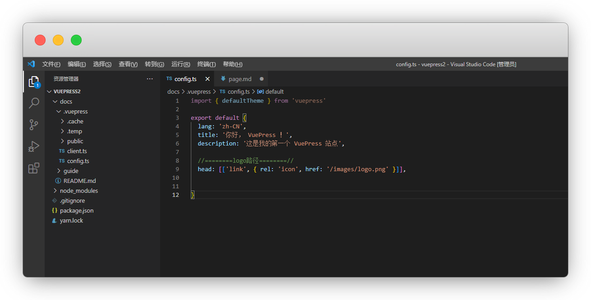
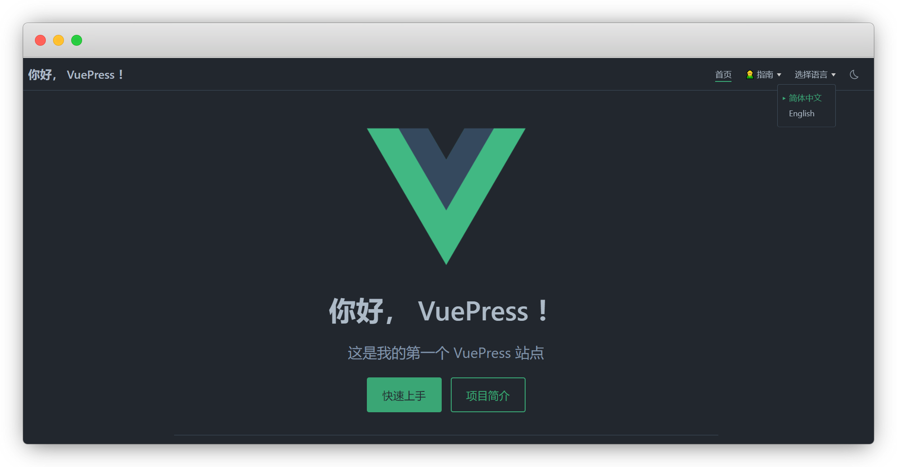
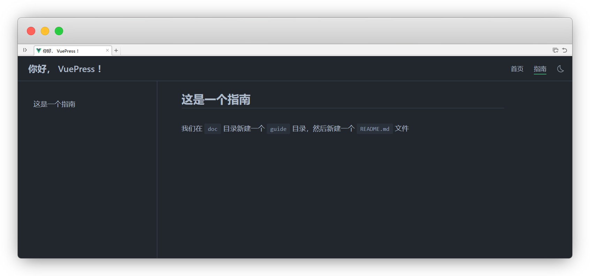

# 页面

::: warning 更新时间
最近更新：2023-8-11

搭建版本：v2.0-beta.66
:::


## 基础配置


### 首页

我们通过 [Frontmatter](./frontmatter.md) ，在 `README.md` 中进行配置和修改


### Logo

网站布局好了，但是logo即Favicon图标还没有，看下官方的目录表

```目录
└─ docs
   └─.vuepress
      └─ public
         └─ images
            └─ logo.png  <- Logo 文件
```


根据目录得知logo文件的位置，在 `.vuepress` 新建一个 `public` 文件夹，再新建一个 `images` 文件夹，放入`logo.png`

::: tip 说明：
官方给的是本地引用，懒人可以直接用远程引用

没有图片显示，确保你文件夹里有图片
:::

打开 `config.ts`文件，添加下列代码中的高亮代码

```ts{4-5}
import { defaultTheme } from 'vuepress'

export default {
  //========logo路径========//
  head: [['link', { rel: 'icon', href: '/images/logo.png' }]],

  //远程引用二选一
//head: [['link', { rel: 'icon', href: 'https://vuejs.org/images/logo.png' }]],
}
```





### 语言栏

要启用 VuePress 的语言支持，首先需要使用如下的文件目录结构

::: tip 说明
实际就是新建一个语言目录，再把根目录所有文档放进去，然后手动翻译

其他国语言也一样
:::

```目录
docs
├─ README.md       <- 默认主页
└─ en              <- 单独新建一个语言目录 例如:en
   └─ README.md    <- 英文版主页
```

在你的 `config.ts` 中设置 locales 选项：

```ts{2-15}
export default {
  //========站点语言配置========//
  locales: {
    //默认语言可以使用 '/' 作为其路径。
    '/': {
      lang: 'zh-CN',
      title: 'VuePress',
      description: 'Vue 驱动的静态网站生成器',
    },
    '/en/': {
      lang: 'en-US',
      title: 'VuePress',
      description: 'Vue-powered Static Site Generator',
    },
  },
}
```


配置完我们发现一个小细节，就是右上角 `Languages` ，切换成中文了，还没有汉字显示


我们需要在`默认主题`下，配置 `selectLanguageName` 和 `selectLanguageText` 来改变


```ts{3-13}
export default {
  theme: defaultTheme({
  //多国语言切换
    locales: {
      '/': {
        selectLanguageName: '简体中文',
        selectLanguageText: '选择语言',
      },
      '/en/': {
        selectLanguageName: 'English',
        selectLanguageText: 'Language',
      },
    },
  }),
}
```



::: tip 说明
这里很多人搞不定，是因为看错了

站点语言是和语言切换位置不一样
```ts
export default {
  //站点语言位置
  theme: defaultTheme({
    //语言切换位置
  }),
}
```
:::


### 搜索框

官方文档使用的是 [Algolia DocSearch](https://docsearch.algolia.com/)，非常的高大上

::: tip 说明
需要提交你的网站 URL 来加入 DocSearch 项目才能获得索引，索引成功创建后， DocSearch 团队会将 `apiKey` 和 `indexName` 发送到你的邮箱

所以，等我们网站搭建完毕后再去提交网址

[☛ 点我查看具体步骤](../guide/plugin.md#docsearch)
:::


## 导航栏


VuePress有一个开箱即用的默认主题，你需要在你的配置文件中通过 theme 配置项来使用它


### 导航标签

在 `config.ts` 中我们先添加一个 `首页`标签


```ts{4-13}
import { defaultTheme } from 'vuepress'

export default {
//========默认主题配置========//
  theme: defaultTheme({
    // 导航栏
    navbar: [
      {
        text: '首页',
        link: '/',
      },
    ],
  }),
}
```


如何继续添加其他的导航标签呢，先看目录表

```目录
└─ docs
   ├─ guide                     <- 目录：指南
   │  └─ README.md 或 index.md  <- 指南的主页
   └─ README.md                 <- 网站的首页
```


我们在 `doc` 目录新建一个 `guide` 目录，然后新建一个 `READE.md` 文件，里面随便打点内容

```md
## 这是一个指南

我们在 `doc` 目录新建一个 `guide` 目录，然后新建一个 `READE.md` 文件
```

::: tip 说明
目录名都用英文！

这样，我们的指南标签的路由，就准备好了

如果访问404了，检查路由是否正确
:::

```ts{10-13}
export default {
  //========默认主题配置========//
  theme: defaultTheme({
    // 导航栏
    navbar: [
      {
        text: '首页',
        link: '/',
      },
      {
        text: '指南',
        link: '/guide/',
      },
    ],
  }),
}
```



其他导航标签添加就不赘述了，如果觉得文字单调，我们还可以添加emoji表情，随便找个网站即可

EmojiXD：[https://emojixd.com/](https://emojixd.com/)

```ts{3}
navbar: [
      {
        text: '🧝 指南',
        link: '/guide/',
      },
    ],
```


### 导航数组

将原先的 `link: '/guide/'` 改成 `children: ['*.md']` ，如下

::: tip 说明
`children` 内包含都是md文件，自己按顺序列出即可
:::

```ts{11-12}
//========默认主题配置========//
  theme: defaultTheme({
    // 导航栏
    navbar: [
      {
        text: '首页',
        link: '/',
      },
      {
        text: '🧝 指南',
        //link: '/guide/'
        children: ['/guide/README.md', '/guide/getting-started.md', '/guide/configuration.md','/guide/page.md']
      },
    ],
  }),
```


在此基础上，我们还可以像官网一样，添加一个组名，也就是再嵌套一个children


```ts{14-21}
//========默认主题配置========//
  theme: defaultTheme({
    // 导航栏
    navbar: [
      {
        text: '首页',
        link: '/',
      },
      {
        text: '🧝 指南',
        //link: '/guide/'
        //children: ['/guide/README.md', '/guide/getting-started.md', '/guide/configuration.md','/guide/page.md']
        //导航数组
        children: [
          {
            //第1组名称(不可点击)
            text: '教程参考',
            //第1组导航标签
            children: ['/guide/README.md', '/guide/getting-started.md', '/guide/configuration.md','/guide/page.md']
          }
         ],
      },
    ],
  }),
```


再继续添加第2组就不演示了，一样在childrren里加

::: tip 说明
我们这里有个小问题，就是`前言`，也就是guide目录下的README.md，一直处于激活状态，这个是默认主页，除非你用其他md文件
:::


### 屏蔽页面

::: warning 注意
若无必要，不要随意更改，屏蔽后会404，需自行修改路由到其他页面

比如你不想让别人访问`guide目录`，即屏蔽掉目录下的`README.md`，直接用 `pagePatterns` 修改页面模式
:::

```ts{5-6}
export default {
  //默认配置无需添加
  //pagePatterns: ['**/*.md', '!.vuepress', '!node_modules'],

  //添加一个屏蔽guide目录下的README.md文件
  pagePatterns: ['**/*.md', '!.vuepress', '!node_modules', '!guide/README.md'],
}
```


## 侧边栏

建议是基本都搭建完成后，再来配置此项目

::: tip 说明
这也是vuepress弊端之一，每次都需要手配
:::

### 单组侧边栏

```ts{4-6}
export default {
  theme: defaultTheme({
    sidebar: [
      //这里填文件路径
      '/guide/README.md', '/guide/getting-started.md', '/guide/configuration.md', '/guide/page.md'
    ],
  }),
}
```

### 多组侧边栏

我们还可以加入父目录大标题，将这些文件放入children中

::: tip 说明
还可以添加远程连接引用
:::

```ts{4-20}
export default {
  theme: defaultTheme({
    sidebar: [
      //父目录包含子文件
      {
        text: '指南',
        link: '/guide/',
        children: ['/guide/README.md', '/guide/getting-started.md', '/guide/configuration.md', '/guide/page.md',
        {
          //子目录远程引用
          text: 'github',
          link: 'https://github.com',
        },
      ],
      },
      {
        //父目录远程引用
        text: 'github',
        link: 'https://github.com',
      },
    ],
  }),
}
```


不同子路径下的页面，使用不同的侧边栏，包括折叠开关

::: tip 说明
多个目录自己挨个添加即可，与guide同级

可以使用折叠开关
:::

```ts{4-10}
export default {
  theme: defaultTheme({
    sidebar: {
      '/guide': [
        {
          text: '指南',
          children: ['/guide/README.md', '/guide/getting-started.md', '/guide/configuration.md', '/guide/page.md',],
          collapsible: true, //折叠开关
        },
      ],
    },
  }),
}
```
